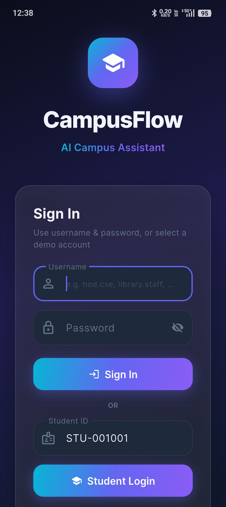
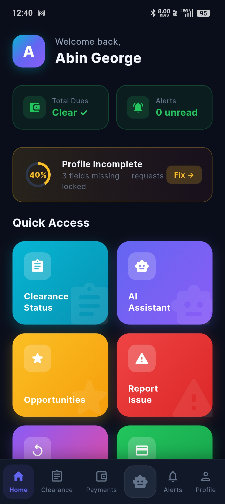
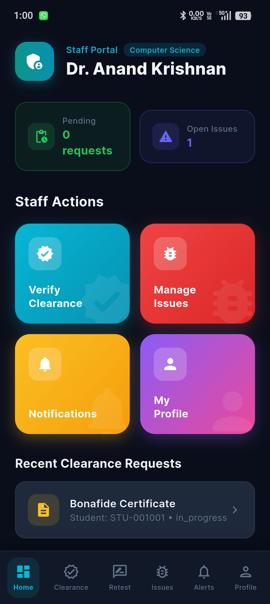
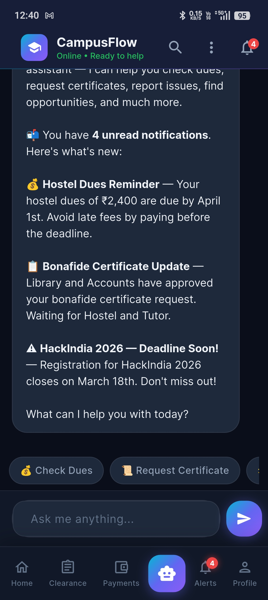
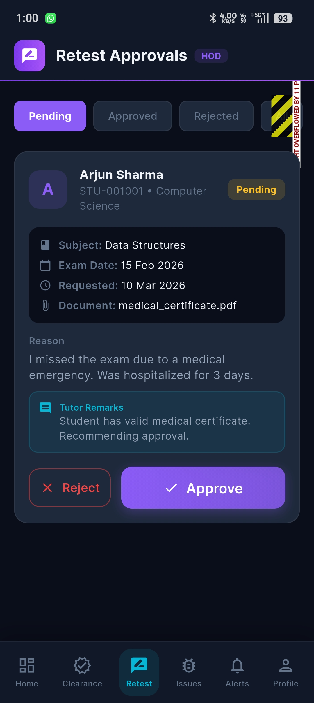
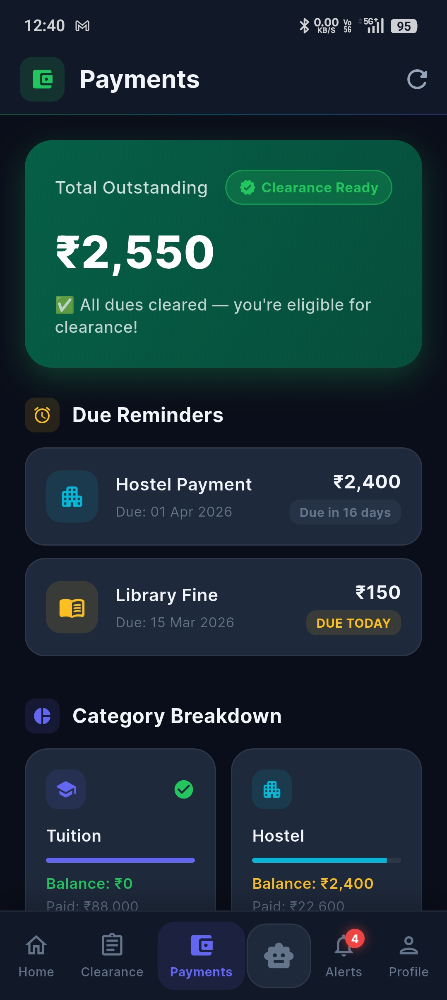

# CampusFlow AI

**Intelligent Campus Assistant** — A fully working Flutter application that automates campus administration using AI-powered natural language processing.

> Built with Flutter + Groq LLM (Llama 3.3 70B) • 9 Integrated Tools • Automated Clearance System

## 🖼️ Screenshots

| Login | Home | Dashboard |
|-----|-------|-----------|
| |   |  |

| AI Chat | Clearance | Payments |
|--------|-----------|----------|
|  |  |  |

---
---

## 🏗️ System Architecture

```
┌────────────────────────────────────────────────────────────┐
│                    CampusFlow AI App                        │
├──────────┬──────────────┬──────────────┬───────────────────┤
│  UI      │  AI Engine   │  Tools (9)   │  Database         │
│  Layer   │  (Groq LLM)  │  Layer       │  Layer            │
├──────────┼──────────────┼──────────────┼───────────────────┤
│ Chat     │ Intent       │ check_dues   │ Student Records   │
│ Screen   │ Detection    │ submit_      │ Dues Database     │
│ Profile  │ Entity       │  clearance   │ Payment Records   │
│ Charts   │ Extraction   │ get_status   │ Documents Vault   │
│ Calendar │ Conversation │ list_opps    │ Opportunities     │
│ Search   │ Memory       │ payments     │ Notifications     │
│ PDF      │ Context      │ report_issue │ Issue Tickets     │
│ Export   │ Awareness    │ documents    │ FAQ Knowledge     │
│          │              │ notifications│ Base              │
│          │              │ faq          │                   │
└──────────┴──────────────┴──────────────┴───────────────────┘
```

---

## 🎯 Three Core Modules

### 1️⃣ AI Campus Assistant

Students interact through natural language — no forms, no menus.

- **"Do I have any dues?"** → Instantly checks all department databases, returns a rich dues card
- **"When is the scholarship deadline?"** → Searches opportunities with profile-matched ranking
- **"Where is the exam office?"** → Queries campus FAQ knowledge base
- **"Show my documents"** → Retrieves ID card, certificates, marksheets from the digital vault

**How it works:**
1. Student types a question in natural language
2. Groq LLM (Llama 3.3 70B) classifies intent across 15 categories
3. Appropriate campus tool queries the database
4. Rich response (cards, tables, lists) displayed instantly

**Conversation Memory:** The AI remembers the last 10 messages, enabling follow-up questions like *"Tell me more about the first one"* after viewing opportunities.

**Impact:** Reduces staff workload • Students get instant answers 24/7 • No office visits needed

---

### 2️⃣ Automated Clearance System *(Main Feature)*

The flagship module — transforms a multi-day, multi-department paper process into a **seconds-long digital workflow**.

**How it works:**
1. Student requests a certificate (transfer, bonafide, no dues, migration, conduct, course completion)
2. System **automatically verifies** 6 department databases:
   - 📚 **Library** — checks fines
   - 🏠 **Hostel** — checks dues (hostel residents only)
   - 💰 **Accounts** — checks tuition balance
   - 🔬 **Lab** — checks lab fees
   - 🍽️ **Mess** — checks mess dues
   - 👨‍🏫 **Tutor/HOD** — auto-approved
3. **All clear → AUTO-APPROVED instantly** (0 days, no signatures)
4. **Dues exist → On Hold** with exact amounts shown, student notified

**Impact:**
- ❌ No physical signatures required
- ❌ No running between departments
- ✅ Process reduced from **days → seconds**
- ✅ Real-time status tracking with per-department visibility

---

### 3️⃣ Smart Opportunity & Notification System

Ensures students never miss important opportunities.

**Active monitoring for:**
- 🎓 Scholarships
- 💼 Internship openings
- 🏢 Placement drives
- 📅 Exam deadlines
- 💰 Fee due reminders

**How it works:**
1. Opportunities are matched against student profile (department, year)
2. Matched students receive targeted notifications
3. Upcoming deadlines appear on the calendar view
4. Urgent items surfaced automatically on login

**Impact:** Right information reaches the right student at the right time

---

## ✨ Features

| Feature | Description |
|---------|-------------|
| 🤖 AI Chat | Natural language processing powered by Groq LLM |
| 📜 9 Campus Tools | Dues, clearance, status, opportunities, payments, issues, documents, notifications, FAQ |
| 🔄 Streaming Responses | Word-by-word text animation with blinking cursor |
| 🧠 Conversation Memory | AI remembers context across messages for follow-ups |
| 📊 Financial Charts | Pie chart (dues breakdown) + line chart (payment history) |
| 📅 Calendar View | Deadline markers with event details |
| 🔍 Chat Search | Real-time message filtering with highlight |
| 💾 Chat Persistence | Conversations saved and restored across sessions |
| 📄 PDF Export | Export chat transcript as styled A4 PDF |
| 🔔 Push Notifications | Local notifications for deadline reminders |
| 👤 Profile Screen | Student details, quick stats, settings |
| 🎨 Premium Dark UI | Glassmorphism design with gradient accents |

---

## 🛠️ Tech Stack

| Component | Technology |
|-----------|------------|
| **Framework** | Flutter (Dart) |
| **AI/LLM** | Groq API — Llama 3.3 70B Versatile |
| **State** | Provider |
| **Charts** | fl_chart |
| **Calendar** | table_calendar |
| **PDF** | pdf + printing |
| **Storage** | shared_preferences |
| **Notifications** | flutter_local_notifications |
| **Fonts** | Google Fonts (Inter) |

---

## 📁 Project Structure

```
lib/
├── main.dart                    # App entry point
├── models/
│   └── models.dart              # Data models (10 classes)
├── providers/
│   └── chat_provider.dart       # State management + streaming
├── screens/
│   ├── login_screen.dart        # Student authentication
│   ├── chat_screen.dart         # Main chat interface
│   ├── profile_screen.dart      # Student profile & settings
│   ├── charts_screen.dart       # Financial overview charts
│   └── calendar_screen.dart     # Deadline calendar
├── services/
│   ├── ai_engine.dart           # Groq LLM + intent routing + conversation memory
│   ├── campus_tools.dart        # 9 campus tools with auto-clearance logic
│   ├── mock_data.dart           # Campus database
│   ├── chat_storage.dart        # Chat persistence
│   ├── notification_service.dart # Push notifications
│   └── pdf_export.dart          # PDF transcript export
├── theme/
│   └── app_theme.dart           # Design system
└── widgets/
    ├── message_bubble.dart      # Chat bubbles with streaming cursor
    ├── dues_card.dart           # Dues summary card
    ├── status_table.dart        # Clearance status tracker
    ├── opportunity_card.dart    # Opportunity listings
    ├── payment_summary_card.dart # Payment details
    ├── document_card.dart       # Document vault
    ├── notification_card.dart   # Notification list
    ├── typing_indicator.dart    # AI thinking animation
    ├── suggestion_chips.dart    # Quick action chips
    └── sidebar_drawer.dart      # Navigation drawer
```

---

## 🚀 Getting Started

```bash
# Clone the repository
git clone https://github.com/yourusername/campusflow-ai.git

# Install dependencies
flutter pub get

# Run the application
flutter run
```

### Test Accounts

| Student | ID | Profile |
|---------|-----|---------|
| Arjun Mehta | STU001 | CS, Year 3, Hostel Resident |
| Priya Sharma | STU002 | ECE, Year 2, Day Scholar |
| Rahul Verma | STU003 | ME, Year 4, Hostel Resident |

---

## 📊 Sample Workflows

**Clearance Request (No Dues):**
> *"I need a transfer certificate"* → *"Yes"* → ✅ All 6 departments auto-approved in seconds

**Clearance Request (With Dues):**
> *"Request bonafide certificate"* → *"Submit"* → ⏸️ Shows exactly which departments have holds and amounts to clear

**Follow-up Conversation:**
> *"Show me opportunities"* → *"Tell me more about the first one"* → AI recalls context and responds about the first opportunity

---

## 📄 License

This project is developed as an academic project for campus administration automation.
